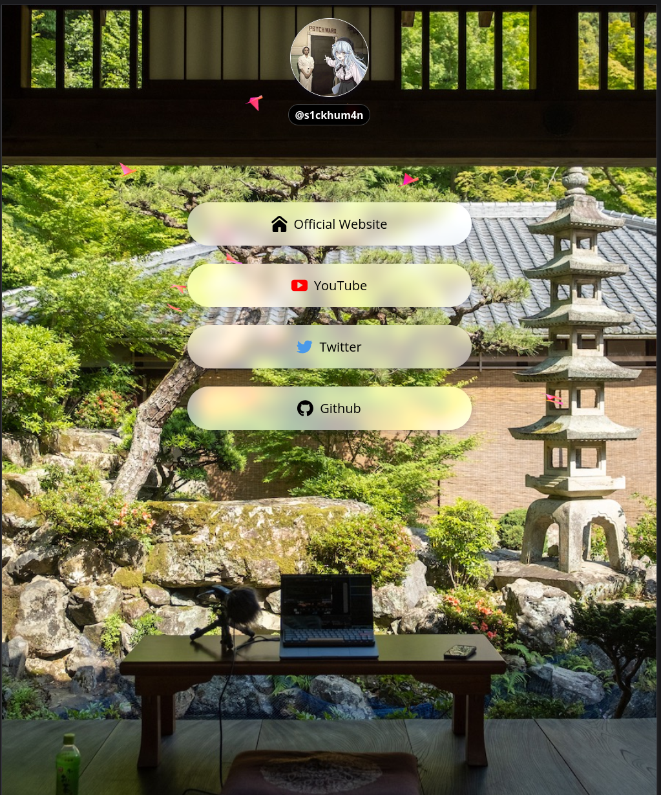

# Biolink Webpage

- simple side project to practice skills, desinged mainly for mobile browsers.

- without using any frameworks like __React__ or __Tailwind CSS__ , this biolign webpage is desinged in pure __HTML__, __CSS__, and __JavaScript__.

- Ulitised [vanta](https://www.vantajs.com/) for eye-candy (the birds).

- motivation [devaslife](https://www.youtube.com/@devaslife)


<br>
<br>

### Usage

- simple server it with any thing of you choice (php, python, etc). For live serving, we can use `live-server`


```bash
$ sudo npm i -g live-server
$ git clone https://github.com/hail0hydra/simple-Biolink && cd simple-Biolink
$ live-server .
```


<br>
<br>

- looks something like this

 
